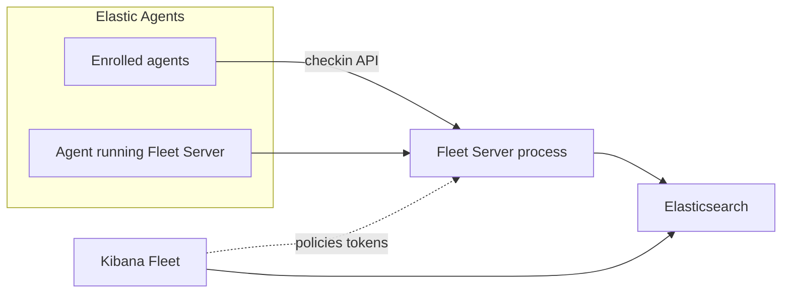

# Fleet Server — agent instructions

This file guides AI agents working in this repository. For hands-on local setup (Docker, benchmarking, cloud), see [docs/developers-guide.md](./docs/developers-guide.md).

## What is Fleet Server

Fleet Server is the control plane for Elastic Agent management — it handles agent enrollment, policy distribution, action scheduling, heartbeat/check-in processing, and artifact downloads. It communicates with Elasticsearch as its data store and exposes an HTTP API for agents.

## Build tool: Mage

The project uses [Mage](https://magefile.org/) as the build tool. The `Makefile` only exists to bootstrap Mage.

```bash
make mage          # Install mage (required first time)
mage -l            # List all available targets
mage -h <Target>   # Help and environment variables for a target
```

Do not add routine build or test flows in Make.
Exception: cloud tooling under `dev-tools/cloud` uses `make -C dev-tools/cloud` (see [docs/developers-guide.md](./docs/developers-guide.md)).

### Common build commands

```bash
mage build:local      # Build binary for local OS/arch → bin/fleet-server
mage clean            # Remove build artifacts (bin/, build/)
mage check:go         # Run golangci-lint
mage check:all        # Run all linter checks
mage generate         # Regenerate code from OpenAPI/JSON schemas
mage test:unit        # Run all unit tests
mage test:integration # Run all integration tests
mage test:e2e         # Run all E2E tests
mage docker:image     # Produce a docker image for a stand-alone fleet-server
```

All targets are defined in [magefile.go](./magefile.go); usage and environment variables for each target are documented in that target’s doc strings.

## Prerequisites

- Go version in [.go-version](./.go-version)
- Docker (build, integration and e2e tests)

## Repository structure

| Area | Role |
|------|------|
| `cmd/fleet/` | Entrypoint → `internal/pkg/server/` |
| `internal/pkg/` | Core implementation (see package table under **Architecture**) |
| `pkg/` | Exported libraries |
| `model/` | OpenAPI/schema sources; run `mage generate` after changes |
| `pkg/api/`, `internal/pkg/api/` | **Generated** from schema — do not edit by hand |
| `testing/` | E2E and helpers; see [testing/e2e/README.md](./testing/e2e/README.md) |
| `dev-tools/` | Developer and build tooling, contains Integration/E2E compose, licenser/goimports tooling, cloud scripts |
| `docs/` | Developer and product documentation |
| `changelog/` | Changelog fragments for releases |
| `build/` | Produced build and testing artifacts |

## Schema and code generation

- [model/schema.json](./model/schema.json) and [model/openapi.yml](./model/openapi.yml) define the data model and API
- `mage generate` regenerates code in `pkg/api/` and `internal/pkg/api/`
- Do not manually edit generated files

## Architecture

### Runtime modes

Fleet Server runs in two modes:

1. **Fleet mode** ([internal/pkg/server/fleet.go](./internal/pkg/server/fleet.go)) — standalone, manages its own lifecycle
2. **Agent mode** ([internal/pkg/server/agent.go](./internal/pkg/server/agent.go)) — supervised by Elastic Agent via the agent-client protocol: https://github.com/elastic/elastic-agent-client

Entry point: [cmd/fleet/main.go](./cmd/fleet/main.go) → `internal/pkg/server/`

### Key internal packages (`internal/pkg/`)

| Package | Responsibility |
|---|---|
| `server/` | Server startup, shutdown, HTTP listener wiring |
| `api/` | OpenAPI-generated types and HTTP handlers (go-chi router) |
| `config/` | Configuration loading and hot-reload |
| `checkin/` | Agent heartbeat / check-in processing (bulk long-poll) |
| `action/` | Action creation, scheduling, and dispatch to agents |
| `policy/` | Policy retrieval and distribution |
| `bulk/` | Batched Elasticsearch write operations |
| `es/` | Elasticsearch client wrappers and query helpers |
| `dl/` | Abstracted data-layer interaction between fleet-server and elasticsearch |
| `cache/` | LRU cache (ristretto) for enrollment keys, policies, etc. |
| `limit/` | Rate limiting for API endpoints |
| `monitor/` | Elasticsearch index change monitoring (long-poll) |
| `logger/` | Zerolog-based structured logging setup |
| `signal/` | OS signal handling and graceful shutdown |

### Data flow (typical agent check-in)

```
Agent HTTP POST /checkin
  → api/ handler
  → checkin/ (long-poll, waits for policy/action changes)
  → monitor/ (watches ES indices for changes)
  → bulk/ (batched ES reads/writes)
  → response with updated policy or pending actions
```

## Deployment architecture

**Production:** Fleet Server is normally **run under Elastic Agent** (same version as that agent). Use the **elastic-agent** image/container for production, not the stand-alone Fleet Server image alone ([README.md](./README.md), [docs/docker-images.md](./docs/docker-images.md)). **Elasticsearch** stores Fleet data; **Kibana Fleet** configures policies, outputs, and enrollment.

**Development:** Local binary via `mage build:local` and config ([fleet-server.reference.yml](./fleet-server.reference.yml), local `fleet-server.yml`). Stand-alone Docker image: `mage docker:image` (dev-oriented). Optional Kibana experimental flag `fleetServerStandalone` for local stand-alone Fleet Server is described in [docs/developers-guide.md](./docs/developers-guide.md). Elastic staff cloud workflows: `dev-tools/cloud` in that guide.

**Versioning:** Agent version ordering and upgrades — [docs/version-compatibility.md](./docs/version-compatibility.md).



## Testing

```bash
mage test:unit              # Unit tests with race detector and coverage
mage test:integration       # Provision Docker ES, run integration tests, tear down
mage test:integrationUp     # Provision integration test environment only
mage test:integrationRun    # Run integration tests (assumes env is up)
mage test:integrationDown   # Tear down integration test environment
mage test:e2e               # Full end-to-end tests
mage test:e2eUp             # Provision E2E test environment
mage test:e2eRun            # Run E2E tests (assumes env is up)
mage test:e2eDown           # Tear down E2E test environment
mage test:all               # Unit + integration + JUnit report
```

Running a single test directly uses the `TEST_RUN=pattern` env var with the `mage test:unit`, `mage test:integration`, or `mage test:e2e` targets for unit tests, integration tests, or e2e tests, respectively.

Test output lands in `build/` (coverage files, JUnit XML, etc.).

Ensure that `mage test:unit` passes before a change is considered complete.
If an integration or e2e test has been added, ensure that it passes by running it with the relevant mage target.

## Dependencies

- `go-elasticsearch/v8` — Elasticsearch client
- `go-chi/chi/v5` — HTTP routing
- `rs/zerolog` — structured logging
- `prometheus/client_golang` — metrics
- `elastic/elastic-agent-client/v7` — agent supervision protocol
- `go.elastic.co/apm/v2` — APM tracing
- `spf13/cobra` — CLI

## Style and code quality

### Lint commands

```bash
mage check:all   # All CI checks (headers, imports, linting)
mage check:go    # golangci-lint only
```

### Rules enforced by tooling

- **Imports/format:** `goimports` via `mage check:imports` / `check:ci` ([magefile.go](./magefile.go)).
- **License headers:** Elastic license via `mage check:headers` (go-licenser).
- **Lint:** [.golangci.yml](./.golangci.yml). Notably: `fmt.Print*` is forbidden — use the zerolog logger; dependencies on `bytedance/sonic`, `elastic/beats`, and `elastic/elastic-agent` are blocked; `nolint` directives must name the specific linter and include an explanation.
- **Generated code:** Change `model/` sources, then `mage generate`; never hand-edit generated API packages.
- **Go toolchain version:** [.go-version](./.go-version).
- **FIPS / crypto:** [docs/fips.md](./docs/fips.md).
  - Any changes that affect cryptography must have a mode that succeeds under the FIPS 140-2 standard.
  - The `requirefips` build tag is used to indicate that FIPS capable mode is used.

## Contribution hygiene

Guiding principles and expectations: [CONTRIBUTING.md](./CONTRIBUTING.md).

- **Fix the root cause**, not a short-term workaround, when possible.
- **Keep changes focused**; avoid unrelated refactors or scope creep.
- **Update docs and tests** when behavior, configuration, or operator-facing workflow changes.
- **Make non-obvious intent clear** through naming, structure, or brief “why” comments when needed.
- **Formatting:** All go files must be formatted with `go fmt`, and imports must be ordereed with `goimports` which can be done with the `mage check:imports` target.
- **Changelog:** For notable changes, add a fragment using **[elastic-agent-changelog-tool](https://github.com/elastic/elastic-agent-changelog-tool)**. Typical usage: `elastic-agent-changelog-tool new "$TITLE"` (see the tool’s [usage docs](https://github.com/elastic/elastic-agent-changelog-tool/blob/main/docs/usage.md)). PRs may use the **`skip-changelog`** label when appropriate; see `changelog/` for examples.
- **`go.mod` / NOTICE:** If you change **`go.mod`** or add/update Go dependencies, regenerate **`NOTICE.txt`** and **`NOTICE-fips.txt`** with `mage check:notice`
- **Before opening a PR:** `mage check:all` and `mage test:unit` must pass at minimum; integration or E2E tests must also pass when behavior depends on Elasticsearch or full HTTP flows (see **Testing** above).
- **Integration / E2E:** When changes affect the API or client communication, run the relevant integration or E2E targets described in the magefile and [testing/e2e/README.md](./testing/e2e/README.md).

## PR Preferences

Always use the [pull request template](.github/PULL_REQUEST_TEMPLATE.md) when creating a pull request.
Always assign the author to the pull request.

Unless instructed otherwise, always add the `Team:Elastic-Agent-Control-Plane` label to the pull request.
Unless instructed otherwise, always add the `backport-active-all` label to the pull request when fixing a bug.

## Further documentation

- [README.md](./README.md) — quick start
- [docs/developers-guide.md](./docs/developers-guide.md) — local stack, Docker, benchmarks, E2E
- [docs/fips.md](./docs/fips.md) — FIPS build instructions
- [docs/version-compatibility.md](./docs/version-compatibility.md) — agent/fleet-server version matrix
- [Elastic Fleet docs](https://www.elastic.co/docs/reference/fleet) — public documentation
